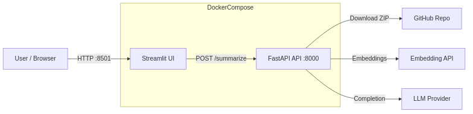
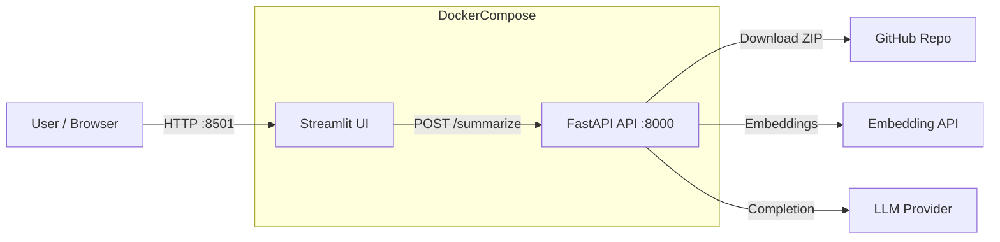
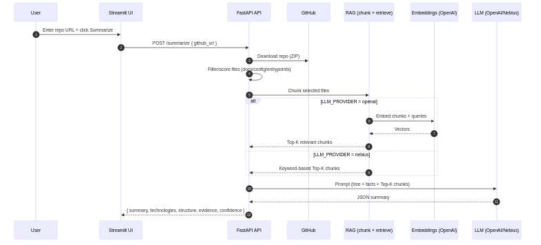
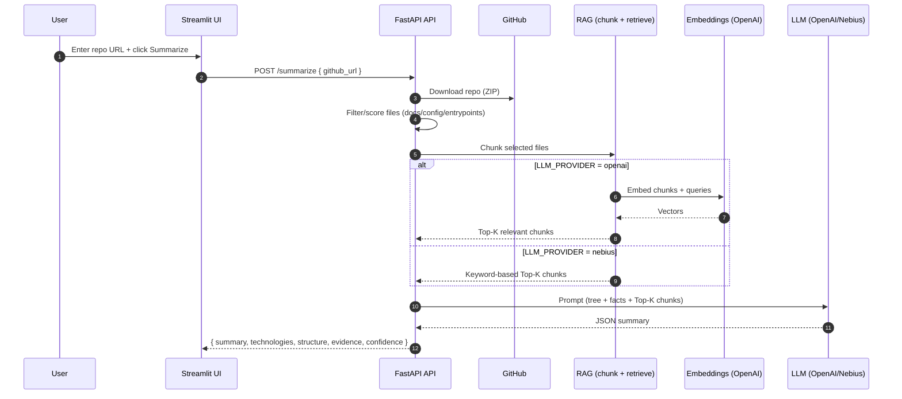
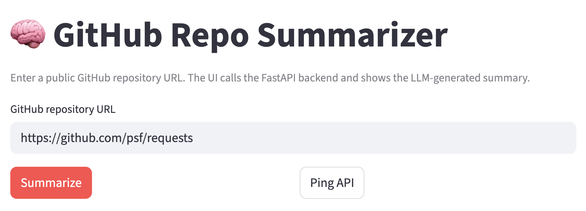
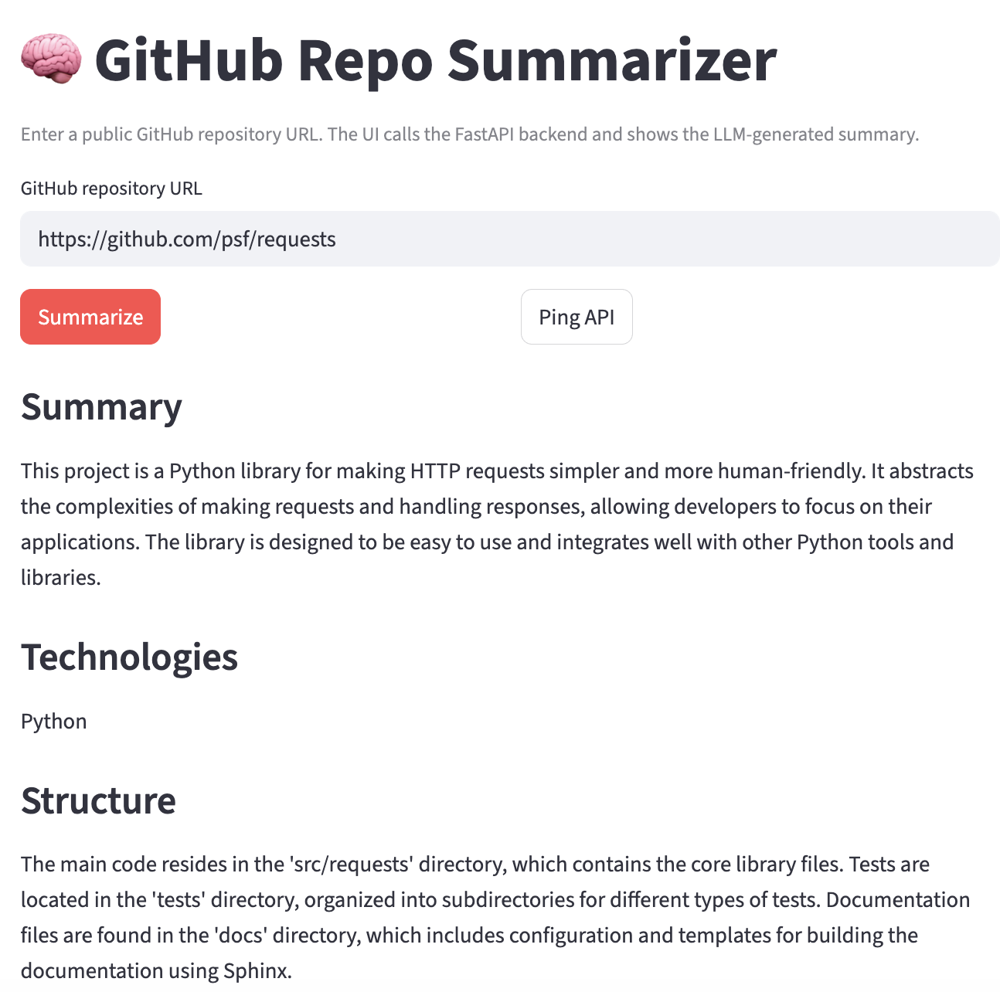

# Repo Summarizer API (FastAPI)

[](https://github.com/Khab40/repo-summarizer-api/actions/workflows/ci.yml)
[](https://github.com/Khab40/repo-summarizer-api/actions/workflows/release.yml)
[](https://github.com/Khab40/repo-summarizer-api/pkgs/container)


API service that accepts a public GitHub repository URL and returns:
- a human-readable summary
- main technologies used
- brief project structure description

It downloads the repo as a ZIP, filters/chooses the most relevant files (README/docs/configs/tree + selected code),
fits them into the LLM context window, and calls an LLM to generate the summary.

### Docker Compose architecture



<details>
<summary>Mermaid source (GitHub Web / VS Code)</summary>




</details>

### API + RAG flow



<details>
<summary>Mermaid source (GitHub Web / VS Code)</summary>




</details>

## Screenshots

Example embedding:




## Requirements
- Python 3.10+

## LLM providers
Supports **OpenAI by default**, and **Nebius Token Factory** optionally.

### OpenAI (default)
Env vars:
- `OPENAI_API_KEY` (required)
- `OPENAI_MODEL` (optional, default: `gpt-4o-mini`)
- `OPENAI_EMBEDDING_MODEL` (optional, default: `text-embedding-3-small`)
  Note: `OPENAI_EMBEDDING_MODEL` controls the embeddings model used for RAG retrieval when `LLM_PROVIDER=openai` (default: `text-embedding-3-small`).
- `OPENAI_BASE_URL` (optional, default: `https://api.openai.com/v1/`)
- `LLM_PROVIDER` (optional, default: `openai`)

### Nebius Token Factory (optional)
Env vars:
- `NEBIUS_API_KEY` (required)
- `NEBIUS_MODEL` (optional, default: `meta-llama/Meta-Llama-3.1-8B-Instruct-fast`)
- `NEBIUS_BASE_URL` (optional, default: `https://api.tokenfactory.nebius.com/v1/`)
- `LLM_PROVIDER=nebius`

## Install (local dev, no Docker)
```bash
python -m venv .venv
source .venv/bin/activate
pip install -r app/requirements.txt
```

## Run locally (OpenAI)
```bash
export LLM_PROVIDER=openai
export OPENAI_API_KEY="YOUR_OPENAI_KEY"
# Optional:
export OPENAI_MODEL="gpt-4o-mini"
export OPENAI_EMBEDDING_MODEL="text-embedding-3-small"

uvicorn app.main:app --host 0.0.0.0 --port 8000 --reload
```

## Run locally (Nebius)
```bash
export LLM_PROVIDER=nebius
export NEBIUS_API_KEY="YOUR_NEBIUS_KEY"
# Optional:
export NEBIUS_MODEL="meta-llama/Meta-Llama-3.1-8B-Instruct-fast"

uvicorn app.main:app --host 0.0.0.0 --port 8000 --reload
```

## Test
```bash
curl -X POST http://localhost:8000/summarize   -H "Content-Type: application/json"   -d '{"github_url": "https://github.com/psf/requests"}'
```

## Docker (optional)
```bash
# OpenAI:
export OPENAI_API_KEY="YOUR_OPENAI_KEY"
docker compose up --build

# Or build the API image directly:
docker build -f app/Dockerfile -t repo-summarizer-api:local .
```

Note: docker-compose includes an API healthcheck using `GET /health` and Streamlit waits for the API to become healthy.

## Error format
On error:
```json
{ "status": "error", "message": "..." }
```

## Repo→LLM strategy (what we send)
1) Directory tree (depth-limited; ignores node_modules, dist, venv, binaries, etc.)
2) README + key docs
3) Dependency/config files
4) Deterministic extraction: dependencies + entrypoints + detected endpoints
5) RAG-selected code chunks: chunk selected important files and retrieve top relevant chunks for: what it does / how to run / endpoints / structure / deps

## RAG retrieval (implementation)
To fit large repositories into the LLM context while keeping high signal, the service uses a lightweight RAG step:
- select important files (README/docs/configs + entrypoints/routes)
- chunk file contents with overlap
- retrieve top‑K relevant chunks for fixed questions (what it does / how to run / endpoints / structure / deps)
- OpenAI provider uses semantic retrieval via embeddings; Nebius falls back to keyword retrieval

The selected snippets (with evidence file names) are combined with a depth‑limited directory tree and deterministic facts before calling the LLM.

## Tests (pytest)

### Install (includes test deps)

```bash
pip install -r app/requirements.txt
```

### Run

```bash
pytest -q
```

### Create the first unit tests

This repo uses only local/mocked tests (no real calls to GitHub/OpenAI/Nebius).


## Answers on submission questions
Q: Which model you chose and why?
A: I chose gpt-4o-mini for Open AI and meta-llama/Meta-Llama-3.1-8B-Instruct-fast for Nebius because of the wish to keep balance between quality, speed and cost.

Q: Your approach to handling repository contents
A: Exclude binaries/build artifacts/generated data; include directory tree + docs + dependency/config files; extract endpoints/entrypoints deterministically; then use RAG-selected top-K chunks (chunk important files and retrieve the most relevant snippets) to fit the LLM context window while keeping high signal.


## Release images

Prebuilt container images are published to GitHub Container Registry (GHCR) for both API and UI.

You can pull them with:

```bash
docker pull ghcr.io/khab40/repo-summarizer-api:latest
docker pull ghcr.io/khab40/repo-summarizer-ui:latest
```

If you want docker‑compose to use the published images instead of building locally, set:

```bash
export REPO_SUMMARIZER_API_IMAGE=ghcr.io/khab40/repo-summarizer-api:latest
export REPO_SUMMARIZER_UI_IMAGE=ghcr.io/khab40/repo-summarizer-ui:latest
```

Then run:

```bash
docker compose up
```

